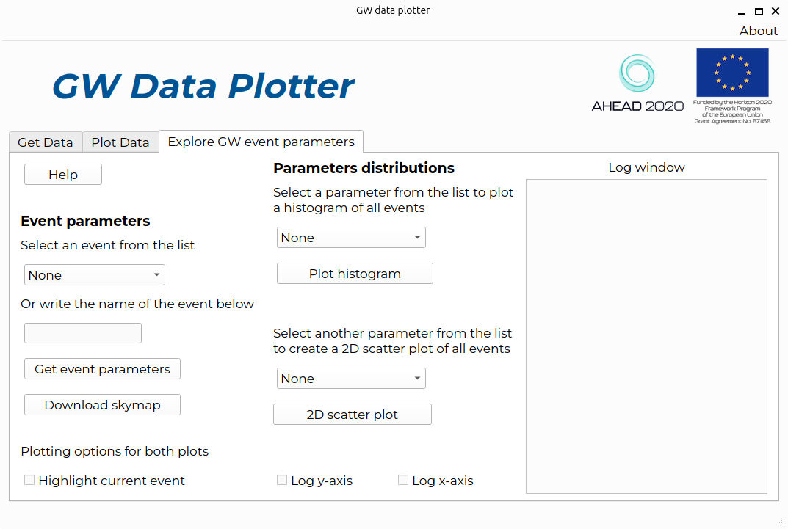

Explore Data
============

The :guilabel:`Explore GW event parameters` tab allows users to download skymaps of GW events and 
analyze parameter distributions with histograms and scatter plots.
To understand the meaning of the different parameters names you can have a look at `this link`_ (under "Event Portal"). 
This tab is organised in two main sections: 

Event parameters
----------------
The section :guilabel:`Event parameters` is useful to explore the parameters of a single known GW event. 
Users can select an event from a list of showcase events or type the name of a published event. 
By clicking on :guilabel:`Get event parameters` users can, then, get the event's main parameters, that will 
be displayed in the :guilabel:`Log window`. 
  
It is also possible to download the skymap for the selected event (skymap is the event's localization 
on the sky) using the button :guilabel:`Download skymap`. 
Note that in this last case, the skymap will be downloaded on your PC as a ``png`` file and then shown.

Parameters distributions
------------------------
The :guilabel:`Parameters distributions` section gives the possibility to retrieve the values of 
selected GW event parameters from all published catalogs and plot them as either a histogram or a 
two-dimensional scatter plot. 

- The selected GW event parameters are:

  - primary mass of the binary system 
  - secondary mass of the binary system 
  - chirp mass
  - remnant mass
  - luminosity distance
  - signal-to-noise ratio
  - merger time

- The procedure to create a histogram and a scatter plot is the following:

  #. Select one parameter from the drop-down menu.
  #. Use the button :guilabel:`Plot histogram` to get the distribution of values on that parameter 
     (the parameter values for all published events are downloaded automatically).
  #. Select another parameter from the lower drop-down menu.
  #. Use the button :guilabel:`2D scatter plot` to get a scatter plot with the first parameter on the 
     x-axis and the second on the y-axis (the parameter values for all published events are downloaded 
     automatically if needed).
  #. If users have previously downloaded the parameters of a specific GW event, they have the option to 
     highlight it in the histogram and scatter plots by selecting the check box 
     :guilabel:`Highlight current event`.
  #. The axes of the plots can be set to logarithmic scale by using the corresponding checkboxes. 
     Note, however, that if you enable :guilabel:`Log x-axis` when plotting a histogram you will have 
     a histogram of the logarithm of the parameter value. 

.. _this link: https://gwosc.org/apidocs/ 
